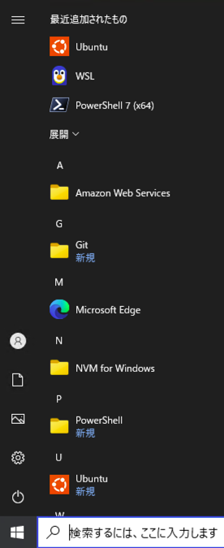
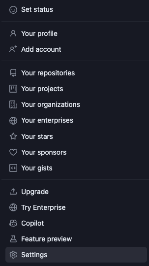
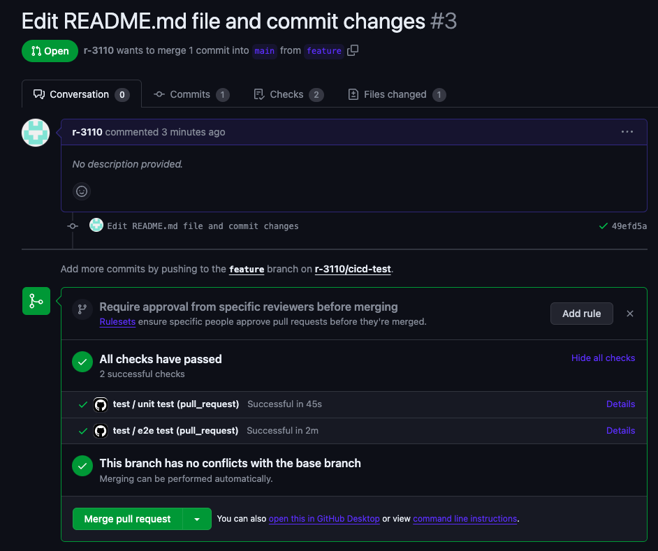

# Github Actionsプレイグラウンド

# 概要

GitHub Actionsの実践のためのコードです。

単体テストとリリースの2つのサンプルを用意しています。

# 動作確認環境

2024/1/19時点

- Windows 10 Pro 64bit(WSL2 Ubuntu 22.04)
- MacOS14 M1 Apple silicon

# 必須条件

- WSL2

  - Windows上では再現が複雑で困難のため、WSL2をインストールしてWSL2のLinux上で実行してください。もしLinux環境が別途用意できるのであれば、こちらは不要です。

- Node.js 20

- Git

- Githubアカウント

- GitコマンドでGithubへhttpsまたはsshでアクセスできる
  - あらかじめGitコマンドでGithubへアクセスできるようにしておきます。詳しくは下記をご覧ください。どちらでも構いませんが、ここではhttpsでの手順について説明します。
    - [https](https://docs.github.com/ja/authentication/keeping-your-account-and-data-secure/managing-your-personal-access-tokens)
    - [ssh](https://docs.github.com/ja/authentication/connecting-to-github-with-ssh/about-ssh)

# 事前準備(Windowsの場合)

1. WSL2のインストール

[こちら](https://docs.microsoft.com/ja-jp/windows/wsl/install-win10)も参考にしつつインストールしてください。
コマンドプロンプトを起動します。


```cmd
 wsl --install
```


成功すると、Ubuntuがインストールされます。
インストール後、Ubuntuを起動します。
起動すると、ユーザ名とパスワードを設定します。




2. パッケージのアップデート

ユーザーを設定したらそのまま作業します。
起動初回はパスワードが求められるので、設定したパスワードを入力します。

```bash
sudo apt-get update
```

3. nvmのインストール

Node.jsのバージョン管理ツールであるnvmをインストールします。

```bash
curl -o- https://raw.githubusercontent.com/nvm-sh/nvm/v0.39.7/install.sh | bash
```

4. bashrcリロード

```bash
source ~/.bashrc
```

5. Node.jsのインストール

20系のNode.jsをインストールします。

```bash
nvm install 20
```

6. Node.jsのバージョン設定

インストールしたNode.jsを使用するように設定します。

```bash
nvm use 20
```

7. Gitの設定

Gitはプリインストールされています。
アカウント名とメールアドレスを設定します。
GitHubのアカウント名とメールアドレスを設定してください。

```bash
git config --global user.name "アカウント名"
```

```bash
git config --global user.email "メールアドレス"
```

8. GitHub personal access tokenの取得

GitHubの画面で自身のアカウントアイコンをクリックしてメニューを開きます。
「Settings」をクリックします。



「Developer settings」をクリックします。


「Personal access tokens」のTokens(classic)をクリックします。


「Generate new token」をクリックします。


Noteに管理しやすいトークン名を任意に入力して、「repo」にチェックを入れます。
「Generate token」をクリックしてトークンを発行します。


作成したトークンが表示されます。このトークンをコピーします。


gitコマンドでGitHubへアクセスする際は、このトークンを使用します。
自身の端末内で厳重に管理してください。

# このソースを取得する

1. リポジトリをフォークする

[こちら](https://github.com/ncdcdev/github-actions-test)からソースをフォークします。
右上の「Fork」から「Create a new fork」をクリックします。

- Owner・・・自身のアカウントを選択します。
- Repository name・・・リポジトリ名を入力します。(規定値でもOK)

作成時のリポジトリ名はアルファベットであれば任意でOKです。しかし自身のアカウントに既に存在するリポジトリ名は使用できないので注意してください。
ご自身で識別しやすい名前にすることをお勧めします。


2. フォークしたリポジトリのアクセス先を確認する

フォークしたリポジトリをGithubで表示します。緑色のアイコン「<> Code」をクリックします。
アクセス先をコピーします。**アクセス先はhttpsとsshとで異なるので注意してください。**
今回はhttpsでのアクセス先を想定します。


3. フォークしたリポジトリをクローンする

自身のPCで任意の作業フォルダを開きます。
2で確認したアクセス先でリポジトリをクローンします。

```bash
git clone <コピーしたアクセス先>
```

コマンドを入力するとユーザ名とパスワードを求められます。

- ユーザ名・・・GitHubのアカウント名
- パスワード・・・事前準備8で取得したトークン

4. クローンできればフォークしたリポジトリ名のフォルダがダウンロードされます。中にこのファイル含むいくつかファイルがあれば、無事クローンできています。

# サンプル その１

# プルリクエストの作成時に、単体テストを実行する

- 以下のコマンドは全てLinux環境(WSL Ubuntu)での作業となります。

1. ブランチの確認

ローカルPCで作業を行います。このファイルと同じ階層へ移動します。
現在がmainブランチになっていることを確認します。

```bash
git branch
```

2. 作業ブランチを作成する

ブランチを作成します。アルファベッドで作成することをお勧めします。

```bash
git checkout -b <branch-name>
```

3. このファイルを編集する

試しに、このファイルを編集してコミットします。

```bash
git add .
git commit -m "test"
```

4. プッシュする

変更をGitHubへプッシュします。

```bash
git push
```

5. プルリクエストを作成する

GitHubの画面からプルリクエストを作成します。
「Pull requests」をクリックして、「new pull request」をクリックします。
「main ← プッシュしたブランチ 」となるようにブランチを選択して、「Create pull request」をクリックします。


Open a pull request画面が表示されたら、「Create pull request」をクリックして作成します。


6. アクションの実行
   作成したらアクションが自動で実行されることを確認します。
   実行アクションの一覧がプルリクエスト画面に表示されます。
   ステータスが全てグリーンの✅になっていればアクションの成功となります。



7. **実践**：　ソースを変更して、プルリクエストを作成してみる

上記のサンプルでは、無事テストのパスが確認できたと思います。
今度は実際にコードを変更して、変更をプッシュしてみましょう。
プッシュしたら再度、アクションが実行されることが確認できます。

# サンプル その2

# mainブランチにマージされたら、リリースを行なう

1. ブランチの確認

ローカルPCで作業を行います。このファイルと同じ階層へ移動します。
現在がmainブランチになっていることを確認します。

```bash
git branch
```

2. フォルダを移動

actions-runnerフォルダに移動します。

```bash
cd actions-runner
```

3. actions runnerをインストールする

下記のコマンドでインストールを行います。

```bash
./install-linux.sh
```


4. フォークしたリポジトリからrunnerを登録方法を確認する

GitHubのフォークしたリポジトリ画面から、
「Settings」=>「Actions」=>「Runners」=>「New self-hosted runner」を開きます。


OSを下記の通り選択します。

Runner image・・・「Linux」
Architecture・・・「x64」


次に、**Configure**欄を確認します。
2つコマンドが記載されています。このうち1つ目の下記のようなコマンドが表示されています。
これをコピーします。

```bash
./config.sh --url リポジトリurl --token xxxxxxxxxxx
```

5. actions runnerを起動する

シェル画面に戻ります。
4でコピーしたコマンドを実行します。
対話形式で設定しますが、今回は全てデフォルトのままでOKです。
全てEnterで進みます。


設定後、さらに下記を実行します。

```bash
./run.sh
```

以上で、actions runnerの設定は完了です。
無事完了すると、runner一覧にrunnerが表示され、アイドル状態になります。


6. 作成したプルリクエストをマージする

GitHubの画面からプルリクエストをマージします。
[サンプルその1](#プルリクエストの作成時に単体テストを実行する)をしていれば、プルリクエストがあると思いますのでこれをマージします。（プルリクエストがない場合は、その1と同じ要領で作成してください）

該当のプルリクエストを開き、「Merge pull request」をクリックします。


7. アクションが実行されることを確認する

マージ後、アクションが実行されることを確認します。
リポジトリの画面から「Actions」を開き、実行されているアクションを確認します。


ステータスが全て✅になればアクションの成功となります。


8. リリースされていることを確認する

アクションが完了したら、ブラウザで http://localhost:3000/ncdc にアクセスします。
下記のような画面が表示されれば、リリースが成功していることになります。


9. **実践**：　ソースを変更して、再デプロイしてみる

上記のサンプルでは、無事デプロイが確認できたと思います。
再度コードを変更して、変更をプッシュ。プルリクエストを作成してみましょう。
プルリクエストをマージしたら再度アクションが実行され、リリースされることが確認できます。

aaaaaaa